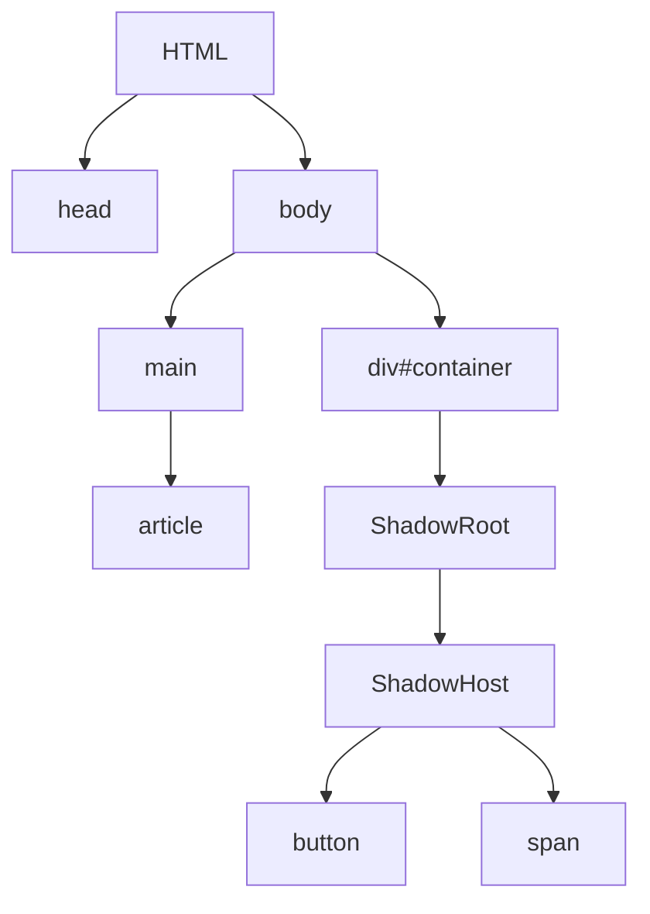

# ウェブコンポーネント（web components）

再利用可能なカスタム要素を作成し、その機能を他のコードから分離して web アプリケーションで利用できるようにする
web コンポーネントは以下の技術を含む。

- カスタムエレメント
- Shadow DOM
- HTML テンプレート

## ウェブコンポーネント実装の基本的な流れ

1. ウェブコンポーネントの機能を持ったクラスもしくは関数を定義。
2. 1.で定義した関数とクラスを登録。
3. 登録したカスタム要素名を HTML 要素のように使う。

必要に応じて shadowDOM や HTML テンプレートを使う。

## カスタム要素（custom elements)

カスタム要素とその動作を定義する為の JavaScriptAPI でフル機能の DOM 要素を独自に構築する方法になる。
カスタム要素の作成は 2 つの方法がある。

- 自律カスタム要素
- カスタム組み込み要素

### 自律カスタム要素(autonomous custom element)

HTML 要素の基底クラスである、`HTMLElement`を継承して、1 から動作を実装する。
完全に独立した新しい HTML タグを定義する為のカスタム要素。
標準の HTML とは異なり、独自の機能や振る舞いを持たせることができる。

#### 自律カスタム要素の例

```javascript
class MyNewElement extends HTMLElement {
  constructor() {
    super();
    this.attachShadow({ mode: open });
    this.ShadowRoot.innerHTML = "<div>my new component!</div>";
  }
}

customElements.define("mu-new-element", MyElement);
```

#### 自律カスタム要素の使用方法

`<my-new-element>`のように HTML タグの記法で使用する。

### カスタム組み込み要素(customized built-in element)

既存の要素を拡張して実装する。
すでに存在する HTML 要素（例えば `<button>`, `<input>`, `<select>` など）を拡張して、カスタマイズした新しい振る舞いを追加するためのカスタム要素。
このタイプのカスタム要素は、既存の HTML 要素に新しい機能やスタイルを追加することができる。

#### カスタム組み込み要素の例

```javascript
class MyButton extends HTMLButtonElement {
  constructor() {
    super();
    this.addEventListener("click", () => alert("Button clicked!"));
  }
}
customElements.define("my-button", MyButton, { extends: "button" });
```

#### カスタム組み込み要素使用方法

`<my-button>`のように HTML タグの記法で使用する。

## Shadow DOM

カプセル化された ShadowDOM ツリー要素に紐づけて関連する機能を制御する為の JavaScriptAPI。
ShadowDOM は mainDOM とは別にレンダリングされる為、要素を公開せずに他の要素との重複することなく script 化や style 化ができる。
カプセル化が重要なポイントになり、ページで実行されるコードが誤ってカスタム要素を壊すことがないようにすることが重要。
ShadowDOM によって DOM ツリー配下に DOM ツリーを取り付けることができる。



- ShadowHost:ShadowDOM がつけられた通常の DOM ノード
- ShadowBorder:ShadowDOM と通常 DOM の境界
- ShadowTree:ShadowDOM の中にあるツリー
- ShadowRoot:ShadowTree の RootNode

### カプセル化

HTML 要素の内部構造を外部から隠す為の仕組み。
具体的にいうと Web ページの HTML 要素に対してシャドウツリーを追加することで、外部の CSS や JavaScript から隔離された独立した DOM を作る。

- 再利用性
- スタイルの衝突を防ぐ
- DOM の衝突を防ぐ

### ShadowRoot

Shadow DOM の最初のノードのこと。
カプセル化された DOM ツリーの最上位のノード。
mode を持ち、open にすると外部からのアクセスを許可、closed は拒否する。

### 例

```HTML
<div id="my-host">
 <p>my past</p>
</div>
```

```JavaScript
 const shadowHost = document.getElementById("my-host");
 const shadowRoot = shadowHost.attachShadow({mode:"open"})
 const p = document.createElement("p");
 p.innerHTML = "<p>my future</p>"
 shadowRoot.appendChild(p);
```

## HTML template

mainDOM の中に`<template>`要素と`<slot>`要素を使って表示されないマークアップのテンプレートを書くことができる。
カスタム要素の構造体を繰り返し使うことができる。

### template 要素

基本的には JavaScript と組み合わせて使う。
script 要素や style 要素を含めることもできる。

```HTML
<template id="template-test">
  <h2>template test</h2>
  <p>this is test </p>
</template>
```

```JavaScript
let tmp = document.getElementById("template-test")
let tmpContent = tpm.content;
document.body.appendChild(tmpContent);
```

テンプレートの対象になるのは以下になる。

```HTML
  <h2>template test</h2>
  <p>this is test </p>
```

`tmpContent`を JavaScript 側で定義しておけば`document.body.appendChild()`で何回も追加することができる。

### slot 要素

基本的には`template`要素と組み合わせて使う。
ある`template`に追加で要素を決定したい時などに使うプレイスホルダー。
Slot を使うことで、テンプレート内部へコンポーネント外部から要素を注入できる。
`template`要素内にある`slot`要素の持つ`name`属性とカスタム要素で設定した使いまわしたい要素に`slot`属性は同じ値でなければならない。

```HTML
<template id="tmp-test">
  <h2>template test</h2>
  <p>this is test</p>
  <slot name="paragraph"></slot>
</template>
<my-slot-test>
  <p slot="paragraph">aaaa</p>
  <p slot="paragraph">bbbb</p>
</my-slot-test>

<my-slot-test>
  <p slot="paragraph">cccc</p>
  <p slot="paragraph">dddd</p>
</my-slot-test>
```

```JavaScript
let tmp = document.getElementById('tmp-test');
class MyTemplateTest extends HTMLElement {
  constructor() {
    super();
    this.attachShadow({ mode: 'open' });
    this.shadowRoot.appendChild(tmp.content.cloneNode(true));
  }
}
customElements.define('my-slot-test', MyTemplateTest);
```
